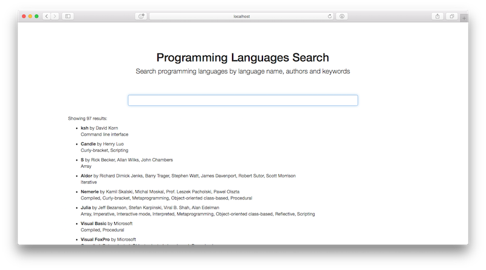
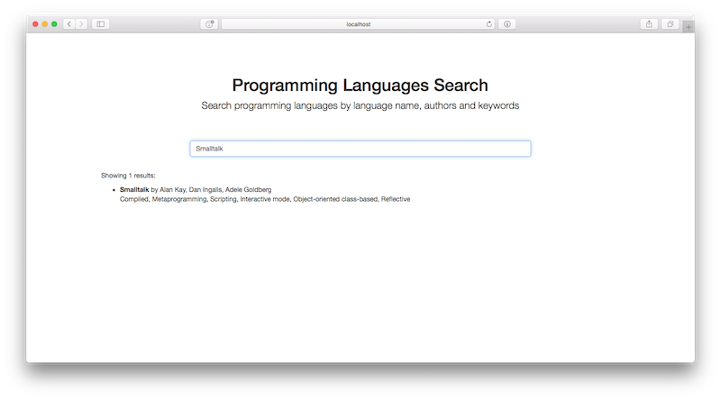

Programming Languages Search
============================

Author: Vladimir Livin

A programming languages search app made with Play 2.4 framework 
and custom-made search algorithm.

App allows to list all programming languages and its features using
beautiful Bootstrap web-interface and Angular for UI logic.

Programming languages databases is provided in JSON format (`data.json``).

You can search for any terms or languages.





## Requirements

- Linux or other Unix
- Java 8+
- SBT 1.3.3+

## Running

```
sbt run
```

Starts app in development mode on port 9000

Uses play 2.4 framework